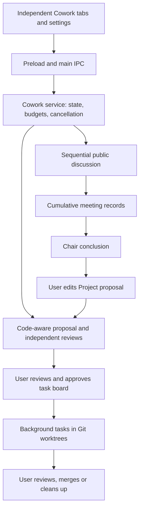

# Mulit-Harness-ADE — Agent Workbench

A lightweight, **agent-native** developer workbench: a Monaco code editor, a Git
visualizer, N embedded CLI terminals, and Cowork multi-agent meetings. Built with Electron +
React + Vite.

*English is the primary language of this README; a 繁體中文 version follows below.*

> **Design principle — official CLIs own the agent runtime.** The workbench uses
> each vendor's official CLI and its existing authentication. It provides code
> editing, Git, terminals, shared memory, and Cowork coordination; Cowork schedules
> CLI calls, stores meeting records, and runs explicitly approved project plans.
> Cross-CLI handoffs use `.project-memory/` (handoff notes + Git).

## Features

- **Monaco editor** — the same editor core as VS Code (via the MIT-licensed
  `monaco-editor`), with edit and diff views, including commit-level diffs from
  the Git panel.
- **Git panel** — status, staging, commit, branch switch, a commit graph, and
  recent-commit / file diffs.
- **Multi-CLI terminals** — each CLI gets its own `xterm.js` terminal tab, run
  natively as a child process via `node-pty`. No keys stored; the CLIs use their
  own subscriptions/auth.
- **Cowork meetings** — independent tabs for Claude Code, Codex, and Antigravity; visible discussion, a selectable recorder, chair conclusions, code-aware project planning, and background execution after user approval. See [Cowork](#cowork) and its [functional architecture](docs/cowork-architecture.md).
- **Collapsible Developer Mode preview** — the center pane starts collapsed and can be toggled from the title bar.
- **Preview & Documents** — live Markdown / HTML preview that auto-syncs on edit and save, plus built-in document viewing for Word, Excel, PowerPoint, and PDF.
- **Vibe Coding Mode** — an alternative, task-first layout (Settings → Appearance → Work Mode): an icon rail (Sessions / Status / Handoff / Files / Git / Settings) whose panels fade in on hover and pin on click, the agent terminal in the middle, and the live result on the right. Dev-server URLs printed in the terminal (`http://localhost:PORT`) open automatically, and the Handoff panel summarises `.project-memory/handoff.md`. Developer Mode keeps the classic code-first layout.
- **Dashboard & Telemetry** — session list plus token usage scanned from local CLI records (Claude Code, Codex, Antigravity), switchable between **All / 30d / 7d / Today** and split into input / cache read / output. Claude and Codex figures come from the CLIs' own usage records; Antigravity logs carry no token counts, so its figures are character-based estimates and are labelled as such. Includes CLI enable/disable filtering, folder grouping, and one-click workspace switching.
- **Fast Startup & Mount-on-Demand** — 42x accelerated cold startup powered by disk-persisted session caches and lazy-loaded sidebar/central panels.
- **Bilingual i18n** — full interface localization supporting seamless toggling between Strict English and Traditional Chinese.
- **CLI Permissions & Bypass Mode** — toggleable bypass mode skipping interactive approval prompts for Claude Code (`--permission-mode bypassPermissions`), Codex (`--dangerously-bypass-approvals-and-sandbox`), and Antigravity (`--dangerously-skip-permissions`).
- **iPhone Remote Control (LAN)** — watch and answer your CLI agents from an iPhone on the same Wi-Fi: a Home Screen web app lists every terminal, mirrors its output, shows an approval card with one-tap answers, lets you type or start new agents, and sends a notification when an agent needs you. It can also open one of your recent workspaces on the computer and start an agent inside it, fits the terminal to the phone's width automatically, previews the dev server a terminal printed, and remembers up to three computers to switch between. See [iPhone remote control](#iphone-remote-control).
- **Architecture overview** — how the desktop app, the phone app and the remote bridge fit together: [`docs/architecture.html`](docs/architecture.html) (open it in a browser).

## Cowork

1. Open **Terminals → + → Cowork**, or choose the Cowork card in **New Terminal**. Each opening creates an independent tab.
2. Choose **Discussion** for a conversation (ordinary folders work too), or **Project** for planning against a Git repository. Select participants, a chair, and models from the installed CLIs' catalogs; model names include their versions. Custom model input is not offered.
3. In Discussion, the chair speaks first and participants respond in order, seeing earlier public replies. Replies appear when each call completes; startup and first-output timings show progress. Send a follow-up to start another round, retry a failed speaker, or explicitly skip that speaker.
4. Select a recorder and choose on-demand/context-limit summaries or a summary after every round. Records contain consensus, disagreements, and open questions; original messages remain available. **Ask the chair to conclude** produces a recommendation for your decision.
5. A current chair conclusion can populate an editable Project proposal. Starting that proposal runs a fresh code-aware planning and review process. Review its task board and unresolved issues, then approve before executing. Further discussion makes the earlier conclusion stale and requires a new conclusion before conversion.
6. Review background task results, then merge or clean up the execution worktrees. Closing a Cowork tab only closes its view; use **Cancel meeting** to stop a meeting. Saved meetings can be reopened from history; tab layouts and unsent drafts are session-local.

**Settings → Cowork** controls default participants, chair, recorder, per-agent model/effort, and budgets for new meetings. Automatic effort uses lower effort for discussion, medium for opening proposals and summaries, and higher for review and conclusions, where the model supports it. Explicit effort choices take precedence.

| Budget | Default | Settings range |
| --- | --- | --- |
| Planning/discussion CLI calls | 6 | 3–30 |
| Active planning/discussion time | 20 minutes | 1–120 minutes |
| Background execution time | 60 minutes | 1–600 minutes |

These are call/time budgets, not a currency or token spending cap. Summaries, chair conclusions, and repair calls also consume planning calls. A round uses one call per active speaker, so its remaining count depends on participants and summarization. Waiting for user input does not consume active planning time. Reaching a limit pauses the flow for an explicit budget increase; the service ceiling is 60 calls / 240 planning minutes, while the Discussion increase button caps at 30 calls / 120 minutes. Settings changes apply to new meetings.

Multiple discussions and project-planning meetings may run concurrently, including in the same repository. **Actual background execution is limited to one run per repository until its execution is merged or cleaned up**; paused/review worktrees still hold that slot. Different repositories may execute concurrently. All tabs share each provider's account quota.



Implementation boundaries, storage, CLI isolation, scheduling, and recovery are documented in [Cowork functional architecture / Cowork 功能架構](docs/cowork-architecture.md).

## Installation

### Method 1: One-Line Quick Install (Windows PowerShell)

Run this command in **PowerShell** (no Git or Node.js required):

```powershell
irm https://raw.githubusercontent.com/zkylek1212-k/Mulit-Harness-ADE/master/install.ps1 | iex
```

> **What this does:** Automatically fetches the latest release from GitHub, downloads the Windows setup installer (`.exe`), and starts the installation.
>
> *Options:*
> - **Silent install** (no wizard prompt):
>   ```powershell
>   $env:INSTALL_SILENT=1; irm https://raw.githubusercontent.com/zkylek1212-k/Mulit-Harness-ADE/master/install.ps1 | iex
>   ```
> - **Download installer only** (saves to current folder without running):
>   ```powershell
>   $env:INSTALL_DOWNLOAD_ONLY=1; irm https://raw.githubusercontent.com/zkylek1212-k/Mulit-Harness-ADE/master/install.ps1 | iex
>   ```

### Method 2: Direct Download from GitHub Releases

Prefer manual download? Grab the setup package directly from GitHub:

- 🚀 **[Download Latest Release](https://github.com/zkylek1212-k/Mulit-Harness-ADE/releases/latest)**
- Download `Agent Workbench-<version>-setup.exe` and double-click to install.
- *(Portable version: download portable archive and run `Agent Workbench.exe` directly without installation.)*

---

## Development & Build from Source

For developers who want to contribute or build from source:

### Requirements

- Node.js 18+ (LTS recommended)
- On Windows the terminal uses a prebuilt native binary (`@lydell/node-pty`); no compiler toolchain is required.

### Getting started

```bash
git clone https://github.com/zkylek1212-k/Mulit-Harness-ADE.git
cd Mulit-Harness-ADE
npm install
npm run dev        # launch in development
```

## Build & Publish

```bash
npm run typecheck  # TypeScript check, no emit
npm run build      # compile main / preload / renderer
npm run dist       # build an installer with electron-builder
npm run release    # (Maintainers only) one-click build and publish to GitHub Releases
```

> **Note on `npm run release`**: This script is strictly for **project maintainers** with repository write permissions. It uses your local GitHub CLI (`gh`) authentication to upload assets. External contributors cannot publish releases or modify repository assets.

Installer output goes to `release/`. Build config is in `electron-builder.yml`.

## Project layout

```
src/main         Electron main process (IPC, git, pty, files, extensions)
src/main/cowork   meeting orchestration, CLI runner, persistence, Git and execution
src/main/remote  LAN remote bridge: HTTPS + WebSocket, local CA, web push, preview proxy
src/preload      the single IPC contract surface
src/renderer/src React UI (editor / git / terminal / preview / dashboard panels)
src/renderer/remote  the iPhone web app (second Vite entry, served by the bridge)
src/shared       types and logic both sides use (remote protocol, detectors)
docs/architecture.html  end-to-end architecture overview
docs/cowork-architecture.md  Cowork flows and implementation boundaries
.project-memory  shared cross-agent memory (handoff, protocol, decisions)
```

## iPhone remote control

Settings → **Remote Control** turns on a small HTTPS server inside the app that only
accepts connections from private LAN addresses (10/8, 172.16/12, 192.168/16).
On Windows, allow **Private networks** when the firewall asks the first time.

Three ports are used, starting from the one in Settings (default `47600`): the port itself
serves the phone app and its WebSocket, `port + 1` serves only the plain-HTTP page that
installs the CA certificate, and `port + 2` serves the dev-server preview proxy.

1. **Trust this computer (once).** Scan the first QR code with the iPhone Camera and open
   it in Safari. Download the profile, install it (Settings → General → VPN & Device
   Management), then enable it under Settings → General → About → Certificate Trust
   Settings. iOS only allows Home Screen web apps, service workers and push
   notifications over a trusted HTTPS connection, which is why this step exists.
2. **Install the app.** Open the app URL in Safari → Share → **Add to Home Screen**.
3. **Pair.** Open it from the Home Screen, press *Generate pairing code* on the computer,
   and type the code (or scan the pairing QR code). Home Screen apps don't share storage
   with Safari, so pair from the Home Screen app.
4. Optional: in the app's settings, turn on notifications to get an alert when an agent
   is waiting for approval or a task finishes.

What you can do from the phone:

- **Per workspace.** Each project window on the computer is its own section, with its
  terminals, its handoff notes (`.project-memory/handoff.md` of *that* workspace) and its
  Git status. Recent workspaces that have no window appear under **Other Workspaces** —
  tapping one opens it on the computer and goes straight to *New Terminal*.
- **Read / Terminal / Preview.** *Read* reflows the terminal output for a phone screen
  (soft wraps joined, TUI borders removed); *Terminal* is the real xterm you type into and
  it fits itself to the phone's width by default — there is nothing to scroll sideways
  (turn it off in the ⋯ menu to see the computer's own width); *Preview* appears when the
  terminal printed a local dev-server URL and shows that site, proxied over HTTPS.
- **Approval cards.** When an agent stops to ask, the question and its options become
  buttons, and *Running / Waiting / Idle* is decided by the computer, not by the phone's
  clock.
- **Up to three computers, one at a time.** The phone remembers up to three computers. The
  title on the home screen is a dropdown that switches between them **without reloading** —
  the app just points its WebSocket at the computer you picked. Add one by its LAN address
  (Settings → *Computers* → Add Computer, or from the pairing screen), pair with it once,
  and rename or forget it from the same list. Two things to know: install each computer's
  certificate on the phone once (the pairing screen links straight to that computer's
  certificate page if it can't reach it), and notifications only arrive from the computer
  that serves the app, because a Web Push subscription is tied to one address.

Security model:

- The local CA carries critical X.509 Name Constraints: it can only sign certificates for
  private IPv4 addresses and `*.local`, so even if its key leaked it could not impersonate
  public websites on your phone. Its private key is encrypted with the OS keychain
  (Electron `safeStorage`). *Reset certificate and devices* creates a new CA.
- Pairing codes are single-use, expire after 5 minutes, and are invalidated after 10 wrong
  attempts. Devices get a random token; only its SHA-256 is stored. Revoking a device
  disconnects it immediately.
- A paired phone has full terminal control, including starting new agents (which honour
  Bypass Mode) and turning Bypass Mode on or off. Turning it on from the phone asks for
  confirmation and shows a notification on the computer. The title bar shows a phone badge whenever a device is connected, and
  pair / connect / spawn / kill events are written to `remote/audit.log` in the app's
  user-data folder (keystrokes are never logged).
- Push notifications are end-to-end encrypted to the phone (RFC 8291) and relayed by
  Apple's push service, so the computer needs internet access for them; everything else
  stays on the LAN.
- The preview proxy never exposes a dev server on its own. It only forwards to
  `127.0.0.1`, only to a port that one of your terminals actually printed, and every
  request needs a cookie that can only be obtained with a single-use ticket issued over
  the authenticated WebSocket (60-second lifetime). Opening a workspace from the phone is
  restricted to the computer's own recent-workspace list.
- Because the phone can switch computers inside one app, the WebSocket handshake accepts
  two kinds of origin: this computer's own app, and the same app served from another
  private-LAN address. Passing that check only gets a socket — it is still dropped after
  five seconds without a valid device token, and pairing over the socket has the same
  single-use code, 5-minute expiry and 10-attempt lockout as before.

In development, the phone client is served from the build output: run `npm run build`
once before testing it with `npm run dev`.

## Configuration notes

- `src/preload/index.ts` is the **single IPC contract** between main and renderer.
- `src/renderer/src/store.ts` holds cross-panel state.
- Theme colors come from CSS variables in `src/renderer/src/styles.css` — do not
  hard-code colors inside panels.
- Per-machine runtime state (`.workbench/settings.json`,
  `.workbench/dashboard-state.json`) is git-ignored; `.workbench/extensions.yaml`
  is the checked-in template. CLI and document-tool paths are auto-detected at
  runtime and default to unspecified until configured in the app.
- Dashboard caches (`dashboard-cache.json`, `usage-cache.json`) live in the app's
  user-data folder, shared by all windows. Each window decides its own
  "Current Workspace"; the main process never uses the focused window to
  attribute sessions.
- `npm run dev` uses its own user-data folder (`agent-workbench-dev`), so a dev
  build can run alongside an installed copy without sharing settings or caches.

## Release Notes & Changelog

See [CHANGELOG.md](CHANGELOG.md) for full version history and release details.

## License

[MIT](LICENSE) © 2026 zkylek1212-k.

## Trademark & affiliation notice

This project is an independent tool and is **not affiliated with, endorsed by, or
sponsored by** Anthropic, OpenAI, Google, or Microsoft. "Claude Code", "Codex",
"Antigravity", "VS Code", and other product names are trademarks of their
respective owners and are used here only nominatively to describe interoperability.
Agent Workbench bundles none of those products; it launches whichever CLIs the
user has installed.

## Third-party software

All bundled runtime dependencies are permissively licensed, including (MIT)
`monaco-editor`, `@monaco-editor/react`, `@xterm/xterm`, `react`, `react-dom`,
`react-markdown`, `rehype-highlight`, `remark-gfm`, `mermaid`, `simple-git`,
`js-yaml`, `@lydell/node-pty`, `ws`, and `qrcode`, plus `node-forge` (BSD-3-Clause,
used to create the remote-control certificates). Their license terms continue to
apply to those components.

The terminal dev-server URL detection (`src/renderer/src/panels/terminal/portDetect.ts`)
is adapted from [AgentsDock](https://github.com/ZhengyiLuo/AgentsDock), licensed under
the Apache License 2.0.

---

# 繁體中文說明

一個輕量、**agent-native** 的開發工作台：Monaco 程式碼編輯器、Git 視覺化面板，以及
N 個內嵌 CLI 終端，以及 Cowork 多 agent 會議。以 Electron + React + Vite 打造。

> **設計原則——由官方 CLI 負責 agent runtime。** 工作台使用各廠商的官方 CLI 與既有登入，
> 提供編輯、Git、終端、共享記憶，以及 Cowork 協調。Cowork 排程 CLI 呼叫、保存會議紀錄，
> 並執行使用者明確核准的專案計畫。跨 CLI 交接透過 `.project-memory/`（handoff 筆記 + Git）完成。

## 功能

- **Monaco 編輯器**——與 VS Code 同款編輯器核心（採 MIT 授權的 `monaco-editor`），
  提供編輯與 diff 檢視，並支援從 Git 面板開啟 commit 層級的 diff。
- **Git 面板**——狀態、暫存、commit、切換分支、commit graph，以及最近 commit／檔案 diff。
- **多 CLI 終端**——每個 CLI 各有一個 `xterm.js` 終端分頁，透過 `node-pty` 以子行程原生執行。
  不儲存金鑰；CLI 使用其自身的訂閱／驗證。
- **Cowork 多 agent 會議**——獨立分頁、可見討論、指定摘要 agent、主席結論、專案規劃與核准後背景執行。支援 Claude Code、Codex、Antigravity；詳見下方〈Cowork 使用方式〉及 [功能架構](docs/cowork-architecture.md)。
- **開發者模式中央預覽收合**——預設收合，可用標題列按鈕切換。
- **預覽與文件**——Markdown／HTML 即時預覽（編輯與存檔自動同步），並內建 Word、Excel、PowerPoint 與 PDF 檢視器。
- **Vibe Coding 模式**——任務優先的另一種版面（設定 → 外觀 → 工作模式）：最左側圖示列（Sessions／Status／Handoff／Files／Git／Settings）游標移過去就淡入彈出、點擊可固定；中間是 Agent 終端，右側是即時成品。終端輸出的 dev server 網址（`http://localhost:PORT`）會自動開啟，Handoff 面板會整理 `.project-memory/handoff.md`。開發者模式維持原本程式碼優先的版面。
- **儀表板與遙測**——從本機 CLI 紀錄（Claude Code、Codex、Antigravity）掃描 session 清單與 token 用量，可切換**總用量／30 天／7 天／今天**，並拆分輸入／快取讀取／輸出。Claude 與 Codex 取自 CLI 自己的用量紀錄；Antigravity 紀錄沒有 token 欄位，數字為字數估算並明確標示。支援 CLI 啟用連動、資料夾群組分類與一鍵工作區切換。
- **極速啟動與按需掛載**——檔案 mtime 持久化快取與面板按需載入（Mount-on-Demand），開機掃描效能大幅提升 42 倍。
- **雙語系支援**——全系統支援嚴謹英文與繁體中文介面即時無縫切換。
- **CLI 啟動權限與略過模式**——全域開關支援切換 AI 代理（Claude Code、Codex、Antigravity）略過互動式審批確認模式，提升自動化執行流暢度。
- **iPhone 遠端控制（區網）**——在同一個 Wi-Fi 下用 iPhone 查看並回覆 CLI agent：加入主畫面的 App 會列出所有終端、同步顯示輸出、用審批卡片一鍵回覆、可以輸入或開新的 agent，agent 等你回覆時會推播通知。也可以請電腦開啟最近用過的工作區並在裡面開 agent、終端會自動配合手機寬度、預覽終端印出的 dev server，並記住最多三台電腦切換。詳見下方〈iPhone 遠端控制〉。
- **架構總覽**——桌面程式、手機程式與遠端橋接怎麼接在一起：[`docs/architecture.html`](docs/architecture.html)（用瀏覽器開啟）。

## Cowork 使用方式

從 **Terminals → + → Cowork** 或 **New Terminal 的 Cowork 卡片**開啟；每次開啟都是獨立分頁。

- **Discussion 討論**：主席先發言，參與者依序看到前面的公開回覆並接續討論。一般資料夾也能使用。每次呼叫完成後顯示回覆，過程可查看啟動與首次輸出時間；追問會啟動下一輪。失敗時可重試或明確跳過該 agent。
- **摘要與主席結論**：指定參與者作為摘要 agent，選擇按需／上下文達門檻時摘要，或每輪摘要。累積紀錄整理共識、歧見與待確認事項，原始訊息仍保留。「請主席總結」提出建議供使用者拍板；繼續追問後，必須重新總結才能轉專案。
- **Project 專案**：可把最新主席結論轉成可編輯提案，或直接開始 Project。系統重新讀取 Git 專案、形成方案、獨立審查並由主席整合；使用者確認任務板與未決事項、核准後，才在 worktree 背景執行。完成後由使用者檢視、合併或清理。
- **設定與預算**：Settings → Cowork 可調整參與者、主席、摘要 agent、模型／強度，以及新會議預算。模型顯示完整版本，沒有 Custom 輸入。自動強度依討論、摘要、審查等階段分配，手動選擇優先。

| 預算 | 預設 | 設定範圍 |
| --- | --- | --- |
| 討論／規劃 CLI 呼叫 | 6 次 | 3–30 次 |
| 討論／規劃有效運作時間 | 20 分鐘 | 1–120 分鐘 |
| 背景執行時間 | 60 分鐘 | 1–600 分鐘 |

這是呼叫／時間預算，不是金額或 token 上限。每輪依發言人數耗用呼叫，摘要、主席結論與格式修復也計入；等待使用者輸入不消耗有效規劃時間。達到上限後暫停，可明確提高該會議預算；服務最高為 60 次／240 分鐘，Discussion 增額按鈕上限為 30 次／120 分鐘。設定變更套用至新會議。

同一 repository 可同時開多場討論與規劃，但**實際背景執行同時限一場，直到合併或清理該次執行**；暫停或等待檢視的 worktree 仍占用名額。不同 repository 可同時執行，各分頁共用供應商帳號用量。關閉分頁只關閉畫面，要停止會議請按 Cancel meeting；紀錄可從歷史重新開啟，分頁版面與未送出草稿只保留於本次程式執行。

上方 [Cowork](#cowork) 附流程圖，完整的模組、資料保存、隔離與執行架構見 [Cowork 功能架構](docs/cowork-architecture.md)。

## 安裝指南

### 方法一：PowerShell 一鍵快速安裝（Windows 推薦）

在 **PowerShell** 貼上並執行以下單行指令（無需 Git 或 Node.js）：

```powershell
irm https://raw.githubusercontent.com/zkylek1212-k/Mulit-Harness-ADE/master/install.ps1 | iex
```

> **說明：** 自動向 GitHub 取得最新版本安裝包（`.exe`），下載並自動啟動安裝精靈。
>
> *進階選項：*
> - **靜默自動安裝**（不彈出安裝引導畫面）：
>   ```powershell
>   $env:INSTALL_SILENT=1; irm https://raw.githubusercontent.com/zkylek1212-k/Mulit-Harness-ADE/master/install.ps1 | iex
>   ```
> - **僅下載安裝檔到本地**（儲存至當前目錄，不立即執行）：
>   ```powershell
>   $env:INSTALL_DOWNLOAD_ONLY=1; irm https://raw.githubusercontent.com/zkylek1212-k/Mulit-Harness-ADE/master/install.ps1 | iex
>   ```

### 方法二：直接自 GitHub Releases 下載

- 🚀 **[前往最新發行頁面（GitHub Releases）](https://github.com/zkylek1212-k/Mulit-Harness-ADE/releases/latest)**
- 下載 `Agent Workbench-<版本>-setup.exe` 雙擊即可安裝。
- *(免安裝綠色版：解壓後直接雙擊 `Agent Workbench.exe` 即可使用)*

---

## 開發與自原始碼建置

若您欲參與開發或進行除錯：

### 需求

- Node.js 18+（建議 LTS）
- Windows 上終端使用預編譯原生二進位（`@lydell/node-pty`），無需編譯工具鏈。

### 快速開始

```bash
git clone https://github.com/zkylek1212-k/Mulit-Harness-ADE.git
cd Mulit-Harness-ADE
npm install
npm run dev        # 開發模式啟動
```

## 建置與發佈 (Build & Publish)

```bash
npm run typecheck  # TypeScript型別檢查，不輸出
npm run build      # 編譯 main / preload / renderer
npm run dist       # 用 electron-builder 產生安裝檔
npm run release    # （僅限專案維護者）一鍵自動編譯、打包並發布至 GitHub Releases
```

> **關於 `npm run release` 的權限說明**：此指令為**專案維護者專用**，執行時會校驗本機 GitHub CLI (`gh`) 身分憑證。未獲授權的外部貢獻者（無倉庫寫入權限者）無法發布 Release，亦無法更動任何 GitHub 上的專案發行檔案。

安裝檔輸出於 `release/`；建置設定見 `electron-builder.yml`。

## 專案結構

```
src/main         Electron 主行程（IPC、git、pty、files、extensions）
src/main/cowork   會議協調、CLI runner、保存、Git 與背景執行
src/main/remote  區網遠端橋接：HTTPS + WebSocket、本機 CA、Web Push、預覽代理
src/preload      唯一的 IPC 契約介面
src/renderer/src React UI（editor / git / terminal / preview / dashboard 面板）
src/renderer/remote  iPhone 端網頁 App（第二個 Vite entry，由橋接層提供）
src/shared       兩端共用的型別與邏輯（遠端協定、各種偵測）
docs/architecture.html  端到端架構總覽
docs/cowork-architecture.md  Cowork 功能流程與模組邊界
.project-memory  跨 agent 共享記憶（handoff、protocol、decisions）
```

## iPhone 遠端控制

設定 → **遠端控制** 會在 app 內啟動一個小型 HTTPS 伺服器，只接受私有區網位址（10/8、172.16/12、192.168/16）連線。Windows 第一次開啟時防火牆會詢問，請允許「私人網路」。

會用到三個 port，從設定中的那個往上數（預設 `47600`）：該 port 本身提供手機 App 與 WebSocket，`port + 1` 只提供安裝 CA 憑證的純 HTTP 頁面，`port + 2` 提供 dev server 預覽代理。

1. **信任這台電腦（只需一次）**：用 iPhone 相機掃第一個 QR code，在 Safari 開啟。下載描述檔並安裝（設定 → 一般 → VPN 與裝置管理），再到 設定 → 一般 → 關於本機 → 憑證信任設定 打開完全信任。iOS 只允許在「可信任的 HTTPS」下使用主畫面 App、Service Worker 與推播，所以需要這一步。
2. **安裝 App**：用 Safari 開啟 App 網址 → 分享 → **加入主畫面**。
3. **配對**：從主畫面開啟，在電腦上按「產生配對碼」後輸入（或掃配對 QR code）。主畫面 App 與 Safari 不共用儲存空間，請在主畫面 App 內配對。
4. 選用：在 App 的設定開啟通知，agent 等待審批或任務結束時會收到提醒。

手機上能做什麼：

- **以工作區為單位**：電腦上每個專案視窗在手機上就是一個區塊，各自有自己的終端、交接筆記（**該工作區**的 `.project-memory/handoff.md`）與 Git 狀態。最近用過但目前沒有視窗的工作區列在**其他工作區**，點一下讓電腦開起來並直接跳到「新增終端」。
- **閱讀／終端／預覽**：「閱讀」把終端輸出整理成手機讀得懂的樣子（接回軟換行、去掉 TUI 框線）；「終端」是真正可以打字的 xterm，預設自動配合手機寬度，不需要左右拖（在 ⋯ 選單關掉就回到電腦的寬度）；「預覽」在終端印出本機 dev server 網址時出現，把那個網站以 HTTPS 代理過來顯示。
- **審批卡片**：agent 停下來問你時，問題與選項會變成按鈕；「執行中／等你回覆／閒置」由電腦判定，不是用手機的時鐘去猜。
- **最多三台電腦、一次連一台**：手機會記住最多三台電腦，主畫面的標題就是切換用的下拉選單，**切換不會重新載入**——App 只是把 WebSocket 指向你選的那台。用區網位址新增（設定 →「電腦」→ 新增電腦，或在配對畫面直接加），各配對一次，同一份清單也能改名與移除。兩件要知道的事：每台電腦的憑證要在手機上各裝一次（連不到時配對畫面會直接給你那台的憑證安裝頁連結）；通知只會來自送來這個 App 的那台電腦，因為 Web Push 訂閱綁在單一網址上。

安全設計：

- 本機 CA 帶 critical 的 X.509 Name Constraints，只能簽私有 IPv4 與 `*.local`；即使私鑰外洩也簽不出能在手機上冒充公開網站的憑證。私鑰以 OS 金鑰（Electron `safeStorage`）加密。「重設憑證與所有裝置」會產生新的 CA。
- 配對碼一次性、5 分鐘失效、錯 10 次作廢。裝置取得隨機 token，本機只存 SHA-256；撤銷裝置會立即斷線。
- 已配對的手機擁有完整終端控制權，包括開新的 agent（會套用 Bypass 模式）與開關 Bypass 模式；從手機開啟 Bypass 需先確認，電腦上會跳出通知。有裝置連線時標題列會顯示手機標示；配對、連線、開關終端等事件記錄在 app 使用者資料夾的 `remote/audit.log`（不記錄任何輸入內容）。
- 推播內容以 RFC 8291 端對端加密給手機，經 Apple 推播服務轉送，因此推播需要電腦能連網；其餘流量都只在區網內。
- 預覽代理本身不會把任何 dev server 曝露出去：它只連 `127.0.0.1`、只連「你的終端真的印出過」的 port，而且每個請求都需要 cookie，那個 cookie 只能用經認證的 WebSocket 發出的一次性 ticket（60 秒有效）換到。從手機開啟工作區也只限電腦自己的最近清單。
- 因為手機能在同一個 App 裡切換電腦，WebSocket 握手接受兩種來源：這台電腦自己的 App，以及同一個 App 由區網上另一個私有位址提供。通過這關只是拿到一條連線——五秒內沒有有效的裝置 token 一樣會被斷開，而走連線的配對仍是一次性配對碼、5 分鐘失效、錯 10 次作廢。

開發模式下，手機端頁面取自 build 產物：用 `npm run dev` 測試前請先執行一次 `npm run build`。

## 設定備註

- `src/preload/index.ts` 是主行程與 renderer 之間的**唯一 IPC 契約**。
- `src/renderer/src/store.ts` 保存跨面板狀態。
- 主題顏色來自 `src/renderer/src/styles.css` 的 CSS 變數——請勿在面板內寫死顏色。
- 每台機器各自的 runtime state（`.workbench/settings.json`、`.workbench/dashboard-state.json`）
  已被 git 忽略；`.workbench/extensions.yaml` 為納入版控的範本。CLI 與文件工具路徑於執行時
  自動偵測，在 app 內設定前預設為未指定（unspecified）。
- 儀表板快取（`dashboard-cache.json`、`usage-cache.json`）放在 app 的使用者資料夾，所有視窗共用。
  「當前工作區」由各視窗自行判斷；主行程不會以「目前聚焦的視窗」來歸屬 session。
- `npm run dev` 使用獨立的使用者資料夾（`agent-workbench-dev`），可與已安裝版本同時執行，互不共用設定與快取。

## 版本紀錄與變更日誌

請參閱 [CHANGELOG.md](CHANGELOG.md) 了解詳細的版本歷程與更新內容。

## 授權

[MIT](LICENSE) © 2026 zkylek1212-k。

## 商標與關聯聲明

本專案為獨立工具，**與 Anthropic、OpenAI、Google、Microsoft 無任何關聯、亦未獲其背書或贊助**。
"Claude Code"、"Codex"、"Antigravity"、"VS Code" 等產品名稱為各自所有者之商標，於此僅作說明
互通性之用（nominative use）。本工作台不捆綁上述任何產品，只啟動使用者自行安裝的 CLI。

## 第三方軟體

所有捆綁的 runtime 依賴皆為寬鬆授權（MIT），包含 `monaco-editor`、`@monaco-editor/react`、
`@xterm/xterm`、`react`、`react-dom`、`react-markdown`、`rehype-highlight`、`remark-gfm`、
`mermaid`、`simple-git`、`js-yaml`、`@lydell/node-pty`、`ws`、`qrcode`，以及 `node-forge`（BSD-3-Clause，
用於產生遠端控制憑證）。這些元件仍受其各自授權條款約束。

終端 dev server 網址偵測（`src/renderer/src/panels/terminal/portDetect.ts`）改寫自
[AgentsDock](https://github.com/ZhengyiLuo/AgentsDock)，採 Apache License 2.0 授權。
