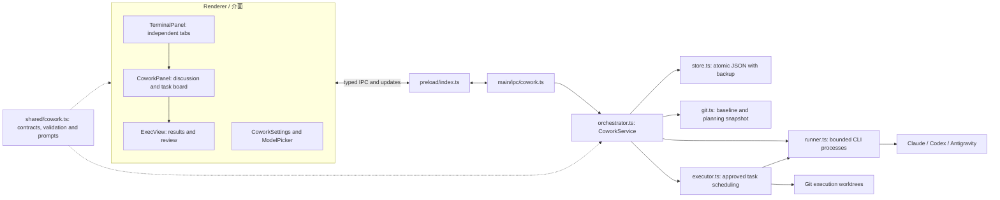
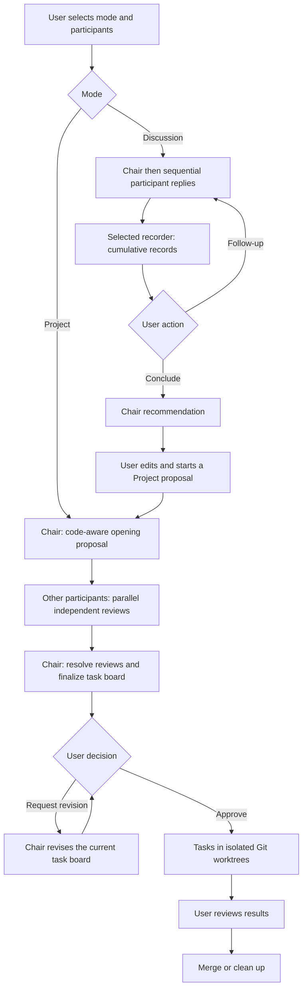

# Cowork functional architecture / Cowork 功能架構

Cowork coordinates installed Claude Code, Codex, and Antigravity CLIs. The desktop app owns meeting state, budgets, records, and scheduling; each official CLI owns model execution and authentication. Discussion and project planning do not authorize repository changes. Background execution requires explicit user approval.

Cowork 協調已安裝的官方 CLI；工作台負責會議狀態、預算、紀錄與排程，官方 CLI 負責模型執行與登入。討論及專案規劃不代表允許修改專案，背景執行須由使用者明確核准。

## Components / 模組

| Boundary / 邊界 | Responsibility / 責任 |
| --- | --- |
| `src/renderer/src/panels/terminal/TerminalPanel.tsx` | Cowork entry points, independent mounted tabs, tab selection and close-view behavior / 入口、獨立掛載分頁、切換及關閉畫面 |
| `src/renderer/src/panels/cowork/` | Discussion, records, chair conclusion, editable conversion, task board and execution review / 討論、紀錄、主席結論、可編輯轉專案、任務板及執行檢視 |
| `src/renderer/src/components/CoworkSettings.tsx` | Defaults for roles, models, effort and meeting budgets / 角色、模型、強度與會議預算預設 |
| `src/preload/index.ts`, `src/main/ipc/cowork.ts` | IPC commands/events, installed CLI capabilities, model catalogs and settings / IPC 指令與事件、CLI 能力、模型清單及設定 |
| `src/main/cowork/orchestrator.ts` | State transitions, public turns, cumulative summaries, chair conclusion, retries, cancellation and call/time limits / 狀態轉換、公開發言、累積摘要、主席結論、重試、取消及呼叫／時間限制 |
| `src/main/cowork/runner.ts` | CLI launch including Windows shims, bounded output, timeout and process termination / CLI 啟動與 Windows shim、輸出上限、逾時及程序終止 |
| `src/main/cowork/git.ts`, `orchestrator.ts` | Repository baseline, isolated snapshot and bounded project context / repository 基準、隔離快照及有界專案上下文 |
| `src/main/cowork/executor.ts` | Approved worktrees, dependency/resource scheduling, task results, merge and cleanup / 核准後 worktree、相依／資源排程、結果、合併與清理 |
| `src/main/cowork/store.ts`, `src/shared/cowork.ts` | Atomic persistence with previous-file fallback; shared schemas, validation, prompts and summary context / 原子保存及前一份備援；共用資料結構、驗證、提示與摘要上下文 |

## Meeting and approval flow / 會議與核准流程

Discussion is a public-turn conversation, not a display of private model reasoning. A follow-up starts another round; the system does not debate indefinitely on its own. A recorder saves cumulative structured records (summary, consensus, disagreements, questions) while retaining raw messages. Before unsummarized context grows beyond the configured internal threshold (20 messages or 18,000 serialized characters), a checkpoint compresses the oldest uncovered chunk. Manual/final summaries cover all remaining chunks. A failed summary does not advance its coverage marker.

Discussion 顯示公開回覆，每次追問開啟下一輪，不會自行無限討論。摘要 agent 保存累積結構化紀錄，原始訊息仍保留。尚未摘要的上下文達內部門檻（20 則或 18,000 個序列化字元）時，先濃縮最早尚未涵蓋的片段；手動／最終摘要會涵蓋剩餘片段，摘要失敗不推進涵蓋位置。

A chair conclusion records which messages it covers. Further discussion makes it stale; only a current conclusion can populate a Project proposal. Conversion does not start planning or execution automatically. Project planning rereads repository context, validates structured proposals/reviews, and leaves unresolved issues for user decisions. Approval then starts background execution; completion still requires result review and a separate merge/cleanup action.

主席結論保存涵蓋的訊息位置；後續發言會讓舊結論過期，僅最新結論可填入 Project 提案。轉換不會自動開始規劃或執行。Project 重新讀取專案並驗證方案／審查，未決事項交由使用者決定。核准後才背景執行，完成後仍須檢視結果並另行合併或清理。

## Isolation, concurrency and budgets / 隔離、並行與預算

- **Discussion** uses an isolated conversation directory without project instructions, project skills or a code snapshot. Claude tools are disabled, Codex runs read-only, and Antigravity uses an isolated home plus tool guards. Ordinary non-Git folders are supported.
- **Project planning** uses an isolated repository snapshot, selected planning instructions/skills and read-only CLI restrictions; modifications detected in planning are rejected. Background execution uses the user's normal CLI configuration inside execution worktrees.
- **Multiple meetings** have independent state, cancellation and budgets. A per-repository execution reservation prevents simultaneous worktree setup; paused or review-stage executions retain the slot until merge/cleanup. Different repositories can execute concurrently. Independent tasks may run in parallel; dependency, overlapping file scopes and exclusive resources constrain scheduling.
- **Budgets** count CLI calls (including summaries, conclusions and repair) and active time rather than currency. Defaults and settings ranges are listed in the [README](../README.md#cowork). Waiting for user input does not consume active planning time. Automatic effort respects the selected model's supported levels and manual overrides. Provider quotas remain shared.

討論使用隔離目錄，不載入專案指令、skills 或快照；專案規劃使用唯讀快照，偵測到修改就拒絕。核准後執行使用正常 CLI 設定。多場會議各自保存狀態、取消與預算；同一 repository 只有一個實際執行名額，跨 repository 可並行。任務相依、重疊檔案範圍與獨占資源會限制任務並行。預算計算呼叫與有效運作時間，各分頁仍共用供應商用量。

## Persistence and recovery / 保存與恢復

Meetings and their artifacts live under Electron `userData/cowork`, grouped by repository and run. JSON manifests are atomically replaced, with a previous-file fallback. Project-planning snapshots are managed separately from execution worktrees; approved execution worktrees live in `<repo>/.cowork/<runId>/`. Persisted meetings can be reopened from history after restart. UI tabs and unsent drafts are session-local. Closing a tab does not cancel a run; cancellation is explicit. Interrupted calls require recovery/retry rather than silently replaying paid work.

會議及相關資料保存在 Electron `userData/cowork`，依 repository 與會議分組；JSON 原子替換並保留前一份備援。規劃快照與執行 worktree 分開管理，核准後執行位於 `<repo>/.cowork/<runId>/`。重新啟動後可從歷史開啟紀錄，分頁與未送出草稿僅限本次程式執行。關閉分頁不取消會議，中斷呼叫需恢復／重試，不會默默重做付費呼叫。

## Verification / 驗證

- `node --experimental-strip-types scripts/check-cowork.mts`: fake-CLI orchestration, validation, summary coverage, budgets, cancellation/recovery, concurrent meetings and execution scheduling.
- `node_modules/.bin/electron scripts/check-cowork-tabs.cjs`: real renderer with mocked IPC, tab independence, records/conclusions, conversion and settings/layout across languages and themes.
- `node_modules/.bin/electron scripts/check-terminal-ui.cjs`: terminal, IME, mobile output and alert regressions.

The new discussion/summary automated checks use fake CLIs. Real-provider response quality, quota errors and latency require live use; the interface exposes public replies and process timings to make that behavior visible.
